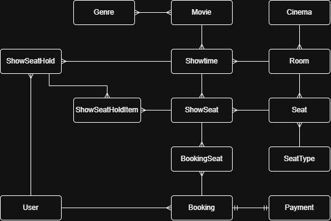

# CinemaBooking API

A REST API for cinema management and the booking flow from temporary seat holds
through VNPay or MoMo payment confirmation. The project demonstrates a layered
Spring Boot architecture, JWT authentication, validation, soft deletion,
transaction boundaries, idempotency, and concurrency control.

## Technology

- Java 17
- Spring Boot 4
- Spring Web MVC
- Spring Data JPA and Hibernate
- Spring Security with JWT
- PostgreSQL
- Maven
- Swagger/OpenAPI

## Architecture

```text
Controller
  -> Service interface
    -> Service implementation
      -> Repository
        -> Entity
```

API input and output use DTOs; controllers do not return JPA entities.

## Available modules

- Authentication: registration, login, refresh token, and logout
- Cinema CRUD
- Room CRUD
- Physical Seat CRUD
- Movie CRUD
- Genre CRUD and Movie-Genre assignment
- Showtime CRUD and filtering
- Showtime seat generation and pricing
- Temporary seat holds with concurrency-safe creation and cancellation
- Booking creation and cancellation
- Idempotent payment attempts using VNPay or MoMo
- Signed return/IPN callback processing

Administrative write endpoints require the `ADMIN` role. Read endpoints require
an authenticated user.

## Conceptual domain model



The diagram is intentionally conceptual: it highlights domain entities and their
relationships without listing database columns, foreign keys, enum values, or
implementation-specific join tables.

Key concepts:

- A Cinema contains Rooms, and each Room contains its physical Seats.
- Movies and Rooms are connected through Showtimes.
- Movies can belong to multiple Genres.
- A ShowSeat represents one physical Seat for one Showtime, with
  screening-specific availability and pricing.
- A ShowSeatHold temporarily reserves ShowSeats for a User through
  ShowSeatHoldItems.
- A Booking belongs to a User and a Showtime, while BookingItems identify its
  selected ShowSeats.
- A Booking can have multiple Payment attempts so a failed attempt can be
  retried.

## Local setup

### Prerequisites

- JDK 17
- PostgreSQL

### Environment

Copy `.env.example` to `.env` and provide local values:

```properties
DB_URL=jdbc:postgresql://localhost:5432/cinema_booking
DB_USERNAME=postgres
DB_PASSWORD=your-password
JWT_SECRET=your-random-secret-at-least-32-characters-long
SEAT_HOLD_DURATION_MINUTES=10
VNPAY_TMN_CODE=your-vnpay-terminal-code
VNPAY_HASH_SECRET=your-vnpay-hash-secret
VNPAY_RETURN_URL=http://localhost:8080/api/v1/payments/vnpay/return
VNPAY_IPN_URL=https://your-public-domain.example/api/v1/payments/vnpay/ipn
MOMO_PARTNER_CODE=your-momo-partner-code
MOMO_ACCESS_KEY=your-momo-access-key
MOMO_SECRET_KEY=your-momo-secret-key
MOMO_REDIRECT_URL=http://localhost:8080/api/v1/payments/momo/return
MOMO_IPN_URL=https://your-public-domain.example/api/v1/payments/momo/ipn
```

The local `.env` file is ignored by Git and loaded automatically by Spring Boot.
Provider IPN endpoints require a public HTTPS URL when testing with a sandbox.

### Run

On Windows:

```shell
.\mvnw.cmd spring-boot:run
```

On macOS or Linux:

```shell
./mvnw spring-boot:run
```

## API documentation

After starting the application:

- Swagger UI: `http://localhost:8080/swagger-ui.html`
- OpenAPI JSON: `http://localhost:8080/v3/api-docs`

Use the authentication login endpoint to obtain an access token. In Swagger UI,
select **Authorize** and enter the JWT; Swagger sends it as a Bearer token.

## Tests

```shell
./mvnw test
```

The test suite includes application-context and focused Movie and Payment
service tests. Provider sandbox calls require valid merchant credentials and are
not executed by the unit test suite.

## Domain notes

- Deletes are soft deletes when a domain object has an active state.
- A physical Seat does not store screening-specific availability.
- Movie and Genre use a many-to-many join table named `movie_genre`.
- Movie and Room are connected through Showtime.
- Showtime scheduling locks the Room row before checking for overlapping
  screenings, preventing concurrent creation for the same room from passing the
  conflict check simultaneously.
- Seat-hold expiration remains intentionally pending for a scheduled job.
- Payment initialization calls run outside database transactions; short
  transactions are used before and after provider network I/O.
- Signed provider callbacks atomically confirm the Booking, succeed the Payment,
  and change held ShowSeats to booked.
